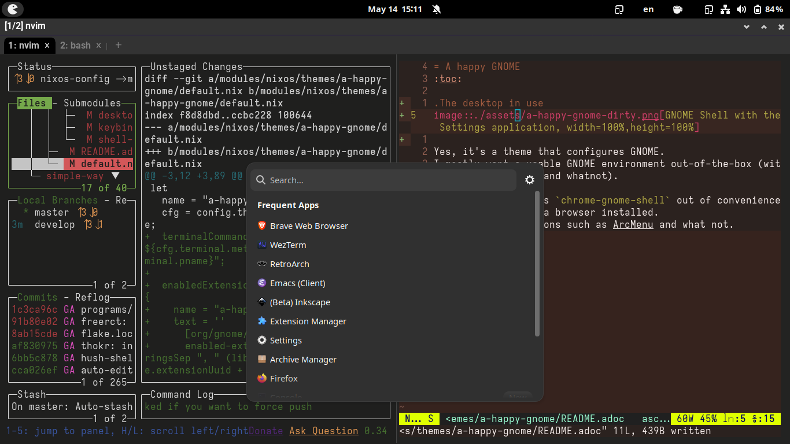

= A happy GNOME
:toc:

.The desktop in use

Yes, it's a theme that configures GNOME.
I mostly want a usable GNOME environment out-of-the-box (with my modifications and whatnot) including a bunch of applications, GNOME extensions, and other core services.
