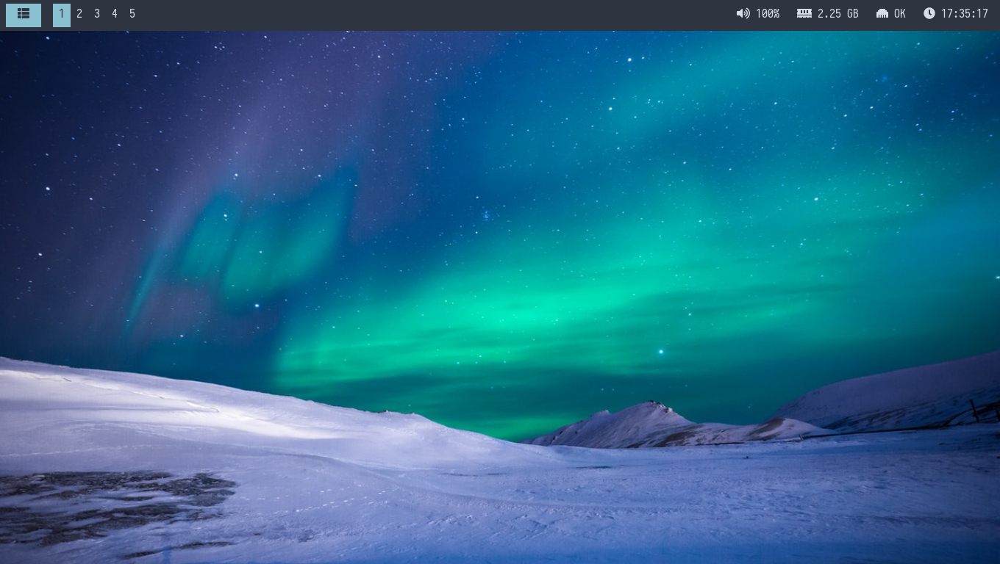
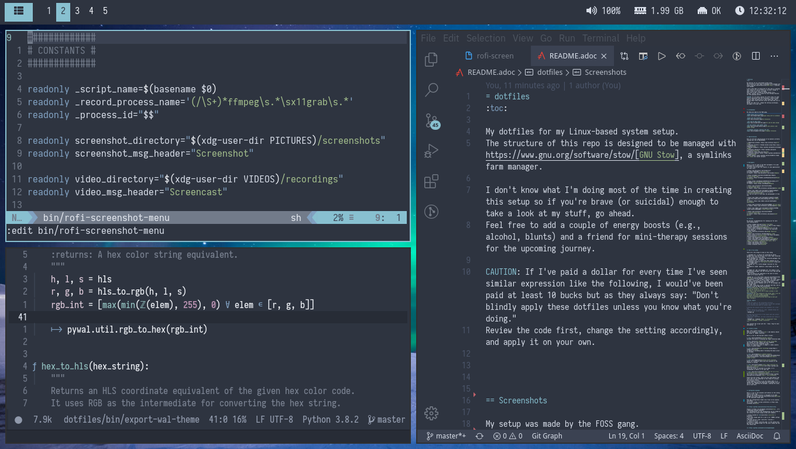
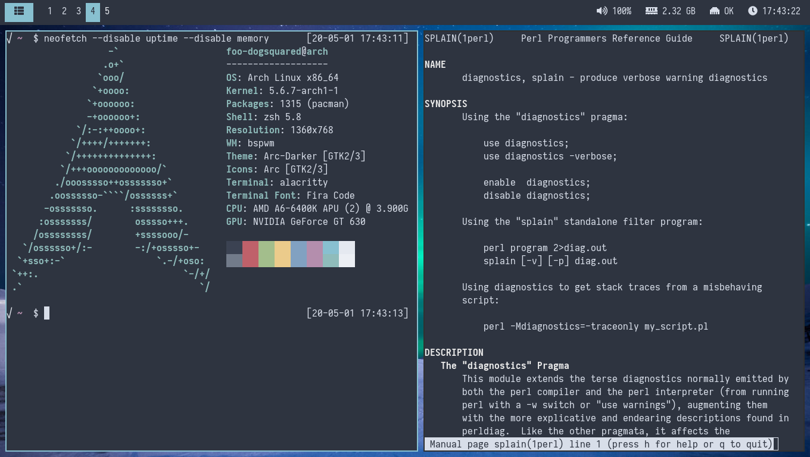
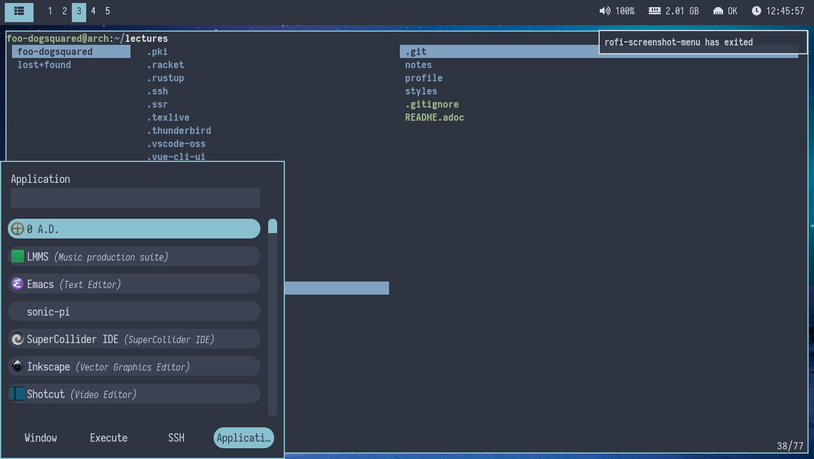
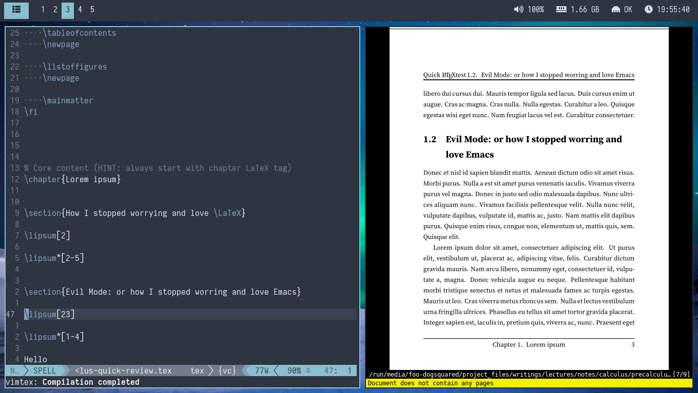
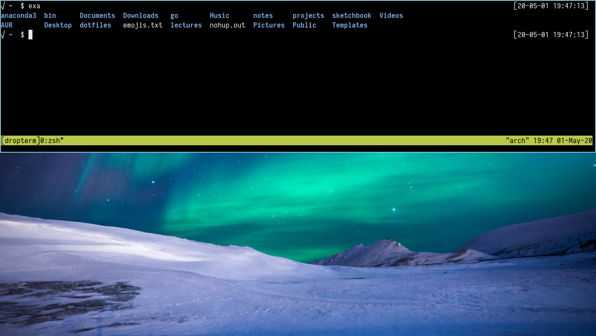

= dotfiles
:toc:

My dotfiles for my Linux-based system setup.
The structure of this repo is designed to be managed with https://www.gnu.org/software/stow/[GNU Stow], a symlinks farm manager.

I don't know what I'm doing most of the time in creating this setup so if you're brave (or suicidal) enough to take a look at my stuff, go ahead.

CAUTION: As they always say: "Don't blindly apply these dotfiles unless you know what you're doing."
Review the code first, change the setting accordingly, and apply it on your own if you want.

== Screenshots

Want to see how my setup look first?
Alright.

.bspwm setup with no windows

.Editors, lots of editors footnote:[For this who are curious for the editors, it's Neovim, Doom Emacs, and Visual Studio Code.]

.bspwm with some terminal applications

.rofi, dunst, and lf

.vim and zathura (and LaTeX) setup

.A dropdown terminal (because why not)

== Specifications

Here are the main specifications of my machine currently running this (as of 2020-09-11):

* **Operating system**: https://nixos.org/[NixOS]-based distros (e.g., NixOS, GuixSD)
* **Display server**: X Window System using https://www.x.org/wiki/[Xorg]
* **Window manager**: https://github.com/baskerville/bspwm[bspwm]
* **Terminal emulator**: https://github.com/jwilm/alacritty/[Alacritty]
* **Shell**: http://www.zsh.org/[Zsh]
* **Terminal emulator font**: https://github.com/be5invis/iosevka[Iosevka]
* **GTK theme**: https://github.com/horst3180/Arc-theme[Arc theme] (Arc Darker variant)

== Tour of my setup

Here's what the setup should look like (aside from the Stow packages which will be discussed later):

[source]
----
dotfiles
├── .vtsm/
├── docs/
├── LICENSE
├── makefile
├── README.adoc
└── vtsm
----

The big picture for my dotfiles setup have big goals and those are (according to priority):

* Easy to transfer and/or reproduce.
* Modularity, https://github.com/holman/dotfiles[@holman]-style.
* Looking cool (but not too cool or else my potato will weep).

=== How I maintain my dotfiles

The dotfiles are mostly intended to be used with GNU Stow.
If you're not familiar with it, you can read http://brandon.invergo.net/news/2012-05-26-using-gnu-stow-to-manage-your-dotfiles.html[this sweet short article] to get you started.

However, with Python 3 (specifically 3.8) installed, you have another option.
Behold, the link:./vtsm["Very Tiny Stow Manager"] (VTSM for short)!
The best way to describe VTSM is basically GNU Stow with a generic shell runner.
VTSM takes inspiration from GNU Stow (obviously) and https://github.com/holman/dotfiles[how Zach Holman's dotfiles are set].
When managing your dotfiles, VTSM is going to be your friend/workmate.

All VTSM needs is a directory containing a package list stored in a JSON file with the name of the packages and their target path.
By default, it searches for a file named `locations.json` but you can specify what JSON file to use with the `-m`/`--manifest` option.

.An example of what a manifest could contain
[source, json]
----
{
    "alacritty": "$HOME/.config/alacritty/",
    "bin": "$HOME/bin/",
    "bspwm": "$HOME/.config/bspwm/",
    "dunst": "$HOME/.config/dunst/",
    "emacs": "$HOME/.config/doom",
    "lf": "$HOME/.config/lf",
    "nvim": "$HOME/.config/nvim/",
    "picom": "$HOME/.config/picom",
    "polybar": "$HOME/.config/polybar",
    "rofi": "$HOME/.config/rofi/",
    "sxiv": "$HOME/.config/sxiv",
    "sxhkd": "$HOME/.config/sxhkd/",
    "wal": "$HOME/.config/wal",
    "xorg": "$HOME",
    "zsh": "$HOME"
}
----

With the tiny manager and the package list, we can then execute commands with all of the packages and its target path with one go.
Here are some examples of running commands with VTSM.

[source, shell]
----
# Take the setup as the filesystem structure.
# See the JSON files at .vtsm to see what packages to be installed and where to install them.

# Running the program without any arguments for a test run.
# There should be a bunch of `echo` commands being ran for all of the listed packages.
./vtsm

# Create the directories of the target path and install them with GNU Stow.
# Bada-bing, bada-boom, you have installed your setup or something.
./vtsm --manifest .vtsm/arch.json --commands "mkdir -p {location} && stow {package} --target {location}"

# Run commands only to Rofi and Emacs config files.
./vtsm --manifest .vtsm/arch.json --only "rofi" "emacs" --commands "stow --restow {package} --target {location}"
----

For the command string, it is a https://docs.python.org/3/library/string.html#string.Template[Python template] with `package` and `location` as the available objects.

=== Custom scripts

Next are more custom scripts!
They're located in link:bin/[`bin/`] and ideally should be linked in `$HOME/.local/bin`.
footnote:[This is a part of the package list but I think it's appropriate to create a dedicated subsection for this.]

Here's a list of the top most useful scripts (at least for me):

* link:./bin/rofi-screenshot-menu[A Rofi menu for all of my screenshoting and screencasting needs].
The script is also a fork of https://github.com/ceuk/rofi-screenshot[`ceuk's` rofi-screenshot].
Big thanks to them for the idea!

* link:./bin/ocr[An image selection-to-text script using OCR].
Capture a region, process it through an OCR engine, and the content are then copied into the clipboard.
Useful for capturing links in images or videos usually found in lecture videos.

* link:./bin/user-prompt[Quick command prompts].
The script is based from https://github.com/LukeSmithxyz/voidrice/blob/master/.local/bin/prompt[Luke Smith's prompt script].

* link:./bin/toggle-process[Switching on/off programs].
Useful for situations where only one instance of the program is desirable.

* link:./bin/choose-emoji-menu[A universal emoji list] for easy copy-pasting and clear communication with those who speak Emojian.

== Configured programs

Here's a list of the programs with details on the config found in this repo.
Each of the listed directory is designed to be used/managed with https://www.gnu.org/software/stow/[GNU Stow] at the indicated target path.

Each of my configuration also tries to be visually consistent but it is only a secondary priority.
For a color scheme, my main preference is https://www.nordtheme.com/[Nord].

=== https://github.com/jwilm/alacritty/[Alacritty]

Similar to https://sw.kovidgoyal.net/kitty[Kitty] , it's a GPU-based terminal emulator.
It's documentation for the configuration can be viewed at the config file itself being filled with comments.

* Config located at link:alacritty/[`alacritty/`] directory.
* The usual target path for a user is at `$HOME/.config/alacritty/`.
* Minimum version (from `alacritty --version`):
** `alacritty 0.3.3`
* Contains a single `alacritty.yaml` as the config file.
Not much has changed except for the color scheme and the font being used.

=== https://github.com/baskerville/bspwm[bspwm]

A minimalist window manager.
Only provides a window manager and nothing else.

* Config located at link:bspwm/[`bspwm/`] directory.
* The usual target path for a user is at `$HOME/.config/bspwm/`.
* Minimum version (from `bspwm --version`):
** `0.9.7-10-g2ffd9c1`
* Simply contains `bspwmrc` which is an executable setting up bspwm-related settings and and starting up some applications.
However, the "true" version is stored as a https://github.com/dylanaraps/pywal/wiki/User-Template-Files[template file] for pywal (located at link:wal/templates/bspwmrc[`wal/templates/bspwmrc`]).
* This allows for a modular setup.
For using keybindings, it uses `sxhkd` (Simple X Hotkey Daemon).
For something similar to i3-bar, https://github.com/polybar/polybar[polybar] serves as the replacement.

To control the window manager, you should use `bspc`.

=== https://dunst-project.org/[Dunst]

It's a notification daemon used to display notifications sent by notifiers (programs that send messages/notifications).

* Config location is at link:dunst/[`dunst/`].
* The usual target path for a user is at `$HOME/.config/dunst/`.
* Minimum version (from `dunst --version`):
** `Dunst - A customizable and lightweight notification-daemon 1.4.1 (2019-07-03)`
* Simply contains a `dunstrc` configuring appearance of the notifications.
Though, the "true" version of the config is located at link:wal/templates/dunstrc[`wal/templates/dunstrc`].

Look out for the related manual entry (i.e., `man dunst`) and the https://wiki.archlinux.org/index.php/Dunst[Arch Wiki entry].

=== https://www.gnu.org/software/emacs/[GNU Emacs]

Another text editor, of course.
I finally bit the bullet with this one with the native support for https://orgmode.org/[Org Mode] as the biggest reason.
(Is this going to be start of something sinister?)

* This package is really a https://github.com/hlissner/doom-emacs[Doom Emacs]-based configuration more than the vanilla config so you need to install it first before touching the config with your grubby hands.
Just run the following command `git clone https://github.com/hlissner/doom-emacs ~/.emacs.d && ~/.emacs.d/bin/doom install` and it should take care of the rest.
* Config located at link:emacs/[`emacs/`].
* The ideal target path for a user is at `$HOME/.config/doom`.
* Minium version (from `emacs --version`):
** `GNU Emacs 26.3`
** For Doom Emacs, it's not particularly important since it's in rolling release but for future references, it is from the `develop` branch at commit https://github.com/hlissner/doom-emacs/commit/efa599f076c3a140c6b4006c352fdba3361abebd[`efa599f076c3a140c6b4006c352fdba3361abebd`] accessed at 2020-04-24.
* The Doom configs are just the default config and some snippets (in `snippets/`) so there's not much to go through here.
* Regarding theming Doom Emacs, I've found mainly two ways.
** First is simply using https://gitlab.com/jjzmajic/ewal[ewal] but the resulting colors are not pretty IMO and I haven't found a way to customize it aside from forking and modifying the package itself.
** Second is simply generating the Doom Emacs theme file myself;
I have a https://gitlab.com/foo-dogsquared/doom-theme-generator[small script] that is generates one from the Pywal color scheme.
** Or simply don't and use https://gitlab.com/protesilaos/modus-themes[modus-themes] instead for that light customization options.

=== https://github.com/gokcehan/lf[lf]

A http://ranger.github.io/[ranger]-inspired terminal file manager.
https://godoc.org/github.com/gokcehan/lf[Here's the documentation for it.]

* Config located at link:lf/[`lf/`] directory.
* The usual target path for a user is at `$HOME/.config/lf/`.
* Minimum version (from `lf --version`):
** `r14`
* All of the config files are basically default config files except with a few personal changes.

=== https://neovim.io/[Neovim]

A modern version of https://www.vim.org/[Vim], a modal text editor.
footnote:[Migrated after I've seen https://lukesmith.xyz/[Luke-senpai] used it in his recent videos.
Seriously though, I find nvim to be way better for configuration.]

* Config located at link:nvim/[`nvim/`] directory.
* The usual target path for a user is at `$HOME/.config/nvim`.
* Minimum version (from `nvim --version`):
** `NVIM v0.4.3`
* Uses https://github.com/junegunn/vim-plug[`vim-plug`] as the plugin manager.
* Contains my plugin list and editor configurations in `init.vim`.
* There are also some https://github.com/sirver/UltiSnips[UltiSnips] snippets stored in `own-snippets` folder (since `snippets` is a reserved folder name).
* One of the largest snippet file is the snippets for LaTeX files.
It is based on https://github.com/gillescastel/latex-snippets/[_Gilles Castel_'s UltiSnips LaTeX snippets].

=== https://github.com/yshui/picom[picom]

A window compositor forked from https://github.com/chjj/compton[compton] that adds off-screen buffers and additional effects and animations to the window.
Can be used for adding style to your setup.

This is formerly the Compton configuration.

* Config found at link:picom/[`picom/`] directory.
* The usual target path for a user is at `$HOME/.config/picom`.
* Minimum version (from `picom --version`):
** `v7.2`
* The config is copied from `/etc/xorg/picom.conf` and edited a few parameters.

For documentation, check out the manual entry (i.e., `man picom`) and the https://wiki.archlinux.org/index.php/Picom[related Arch Wiki entry].
The default configuration (located at `/etc/xdg/picom.conf` assuming at Arch Linux) can be helpful as well as it is filled with comments.

=== https://github.com/polybar/polybar[polybar]

A tool for creating status bars.

This is the replacement bar from my previous i3-based setup.

* Config located at link:polybar[`polybar/`].
* The usual target path for a user is at `$HOME/.config/polybar`.
* Minimum version (from `polybar --version`):
** `polybar 3.4.1`
** `Features: +alsa +curl +i3 +mpd +network(libnl) +pulseaudio +xkeyboard`
* There is only the standalone config (might decide to make it modular) and the launch script which is copied from the https://wiki.archlinux.org/index.php/Polybar[related Arch Wiki entry].
The theme is dynamically used with the Xresources file (by using `xrdb`).

For documentation, check out the https://wiki.archlinux.org/index.php/Polybar[already linked Arch Wiki entry] and the https://github.com/polybar/polybar/wiki[official documentation from GitHub].

=== https://github.com/davatorium/rofi[Rofi]

The application switcher and launcher.
Also serves as a replacement for https://tools.suckless.org/dmenu/[dmenu].

* Config located at link:rofi/[`rofi/`].
* The usual target path for a user is at `$HOME/.config/rofi/`.
* Minimum version (from `rofi -version`):
** `Version: 1.5.4`
* Main config is `config.rasi`.
* Contains the config and my custom Rofi themes.

To see the documentation, check out the manual entry for `rofi`.
For creating or editing Rofi themes, read the manual entry of `rofi-theme`.
Also, view the related https://wiki.archlinux.org/index.php/Rofi[Arch Wiki entry].

=== https://github.com/naelstrof/slop[slop]

A select operator for X-based systems with all the fanciful bell and whistles.

* Config located at link:slop[`slop`].
* The usual target path is at `$HOME/.config/slop`.
* Minimum version (from `slop --version`):
** v7.5
* It only contains customized selection shaders and whatnot that may be used for my custom scripts.

=== https://github.com/baskerville/sxhkd[sxhkd]

Stands for "Simple X Hotkey Daemon".
It is a hotkey daemon detecting certain X events primarily from the keyboard and mouse.

It is also very useful since it enables modular setup.
Can be used independent of the desktop environment (DE) or the window manager (WM).

* Config located at link:sxhkd/[`sxhkd/`] folder.
* The usual target path is at `$HOME/.config/sxhkd`.
* Minimum version (from `sxhkd --version`):
** `0.6.0-3-g7124055`
* Contains a config file (`sxhkdrc`) for the keybindings.
There are some keybindings specifically used for `bspwm`.

=== https://github.com/muennich/sxiv[sxiv]

A simple developer-oriented X image viewer with a lot of options for customization.

* Config located at link:sxiv/[`sxiv/`] directory.
* The usual target path is at `$HOME/.config/sxiv`.
* Minimum version (from `sxiv -v`):
** `sxiv 26`
* Contains custom keybindings (with `exec/key-handler`) and a configuration for the status bar (with `exec/image-info`).

sxiv has a manual (i.e., `man sxiv`) so that's convenient.
I also recommend https://www.youtube.com/watch?v=GYW9i_u5PYs[Luke Smith's video] introducing it.
That's where I also heard of it.

=== https://www.zsh.org/[Zsh]

A Unix shell and an alternative to the Bash.
Mostly chosen due to its wide options for customization compared to GNU Bash.

* Config found at link:zsh/[`zsh/`] directory.
* The usual target path for a user is at `$HOME/.config/zsh`.
You do have to set `ZDOTDIR=$XDG_CONFIG_HOME/zsh` at `/etc/zsh/zshenv` (requires root privilege) though.
* Minimum version (from `zsh --version`):
** `zsh 5.7.1 (x86_64-pc-linux-gnu)`
* Contains `.zprofile` and `.zshrc`.
The primary file to look for is the `.profile` to set environment variables independent of the shell setups.
* Previously relied on https://github.com/robbyrussell/oh-my-zsh/[oh-my-zsh].
Eventually, the config became independent and can work without it.

For the documentation, check out the manual entry for `zsh` to gain an overview of the shell.
The documentation itself is massive and comprehensive.
The main manual explains some things such as the startup/shutdown files and compatibility with other shells.
It also lays out the sections of the manual which you can check it out.

Since the manual has been split into multiple sections, it can be daunting to navigate.
The most referred sections by far are `zshmisc` where it gives details on the miscellanea of zsh such as the prompt and special variables you might want to know.
The other section is `zshbuiltins` where it explains built-in commands of zsh.

For coding with Zsh, look into the http://zsh.sourceforge.net/Doc/Release/index.html[Zsh Manual].

== Additional programs used

As much as possible, I use free and open source software (FOSS) for all of my needs.
Not all of the items listed are FOSS, though.
footnote:[You can also view the package lists at the project root for a detailed list.]

=== Browser extensions

* https://bitwarden.com/[Bitwarden] - An open source password manager.
Comes with a browser extension or a desktop version of the app.
* Internet Archive Web Extension (https://chrome.google.com/webstore/detail/wayback-machine/fpnmgdkabkmnadcjpehmlllkndpkmiak[Chrome] and https://addons.mozilla.org/en-US/firefox/addon/wayback-machine_new/[Firefox] version) - A browser extension for tracking down the saved versions of a page.
Very useful extension for tracking old resources that has been moved or deleted.
* https://github.com/gorhill/uBlock[uBlock Origin] - A security tool for blocking known trackers.
* https://www.one-tab.com/[OneTab extension] - An extension to enable grouping of tabs into one tab.
Convenient for preventing a lot of tabs opened at one time.
* https://www.eff.org/privacybadger[Privacy Badger] - A security tool for blocking trackers.
Unlike the other blockers like uBlock Origin, Privacy Badger learns with more usage.

=== Command line tools

I still use https://www.gnu.org/software/coreutils/[GNU coreutils] and common Unix tools (e.g., https://curl.haxx.se/[cURL]) but it could be good to find some alternatives.
If you want to look for some alternatives or just feeling adventurous yourself, I recommend starting with https://github.com/agarrharr/awesome-cli-apps[this awesome list] and https://github.com/alebcay/awesome-shell[this one, too].

* https://github.com/sharkdp/bat[bat] - Basically `cat(1)` with wings.
* https://github.com/jarun/Buku[Buku] - A developer-oriented (i.e., easy to integrate with your own programs) browser-independent bookmark manager for the command line.
* https://github.com/cookiecutter/cookiecutter[Cookiecutter] - A project template generator for your... projects. :)
* https://github.com/ogham/exa[exa] - A user-friendly replacement for `ls(1)`.
* https://github.com/sharkdp/fd[fd] - A user-friendly alternative to `find(1)` from https://www.gnu.org/software/findutils/[GNU `findutils`].
* https://feh.finalrewind.org/[feh] - A minimal image viewer.
* https://github.com/junegunn/fzf[fzf] - A fuzzy command line finder.
* https://github.com/sharkdp/hexyl[hexyl] - A hex viewer on the command line.
* https://github.com/gokcehan/lf[lf] - A terminal file manager mainly inspired by http://ranger.github.io/[Ranger].
* https://github.com/naelstrof/maim[maim] - A simple screenshot utility.
* https://github.com/dylanaraps/neofetch/[neofetch] - A program for getting information for your hardware and software setup.
footnote:[You can also take a look at https://github.com/dylanaraps/pfetch[pfetch] (created by the same author) which can be an excellent reference for getting system information between Unix-based systems.
Seriously though, it's insane;
the guy's a wizard.]
* https://neovim.io/[Neovim] - A modern fork of https://www.vim.org/[Vim].
* https://github.com/BurntSushi/ripgrep[ripgrep] - A fast alternative to https://www.gnu.org/software/grep/[GNU `grep`].
* https://weechat.org/[Weechat] - An IRC client on the command line.
* https://github.com/ytdl-org/youtube-dl[youtube-dl] - A utility for downloading YouTube videos (and also others).

=== Design

* https://blender.org/[Blender] - A top-notch 3D modelling program.
* https://draw.io/[draw.io] - A drawing board for your flowcharts and other charts, maybe.
* https://www.freecadweb.org/[FreeCAD] - A general purpose 3D computer-aided design program.
* https://inkscape.org/[Inkscape] - A vector illustration/editing program. Alternative to Adobe Illustrator.
* http://www.kicad-pcb.org/[KiCad] - An electronic design automation suite.
* https://krita.org/en/[Krita] - A painting/illustration program.

=== Desktop user experience

* https://github.com/tmux/tmux/[tmux] - A terminal multiplexer useful for managing multiple sessions.
* https://github.com/noctuid/tdrop[tdrop] - A modular dropdown creator.
* https://github.com/dylanaraps/pywal[pywal] - An automation tool for generating color schemes from images and applying them to your programs.

=== Device drivers and servers

* https://wiki.archlinux.org/index.php/Advanced_Linux_Sound_Architecture[ALSA] - A Linux sound driver.
* https://wiki.archlinux.org/index.php/NetworkManager[GNOME NetworkManager]
* https://www.nvidia.com/Download/index.aspx?lang=en-us[NVIDIA Driver] - Since I have an NVIDIA-based GPU (NVIDIA GeForce GT 630), I have to use that.

=== Documents

* https://asciidoctor.org/[Asciidoctor] - A text formatting language suitable for creating books, documentations, and writings.
Highlights a heavier feature set compared to Markdown.
* https://github.com/gohugoio/hugo[Hugo] - A static site generator for creating websites and personal wikis.
* https://jupyter.org/[Jupyter] - Similar to R Markdown except with a stronger emphasis for https://en.wikipedia.org/wiki/Literate_programming[literate programming].
This is closely associated with the https://anaconda.com/[Anaconda distribution].
Useful for a variety of document formats to be converted into a website especially with the (bare) support for https://pandoc.org/[Pandoc] converter.
* https://www.libreoffice.org/[LibreOffice] - An office productivity suite and serves as a free alternative to Microsoft Office suite.
* http://luatex.org/[LuaTeX] - The TeX engine I primarily use for my LaTeX documents.
* https://orgmode.org/[Org-mode] - A lightweight text formatting language that offers a variety of export options, literate programming, and reproducible of stuff similar to Jupyter Notebooks.
* https://pandoc.org/[Pandoc] - A universal document converter that supports a wide variety of document formats.
Primarily used for converting Markdown documents into Asciidoctor text.
* https://rmarkdown.rstudio.com/[R Markdown] - A text formatting language that comes with executing programs with live output in the notebook.
* https://www.tug.org/texlive/[TeX Live] - A cross-platform LaTeX distribution for compiling LaTeX files.

=== Fonts

* https://github.com/belluzj/fantasque-sans[Fantasque Sans Mono] - A serif-style monospace font for fancy occasions.
* https://github.com/tonsky/FiraCode[Fira Code] - A programmer-oriented font that supports ligatures.
* https://fontawesome.com/[Font Awesome] - A set of icons for your user interface and stuff.
* https://github.com/be5invis/iosevka[Iosevka] - A monospace text that features ligatures and provides a wide variety of symbols.
It is currently my terminal font.
* https://www.jetbrains.com/lp/mono/[Jetbrains Mono] - A free and open source font featuring ligatures by Jetbrains.
* http://www.gust.org.pl/projects/e-foundry/lm-math[Latin Modern Math] - A serif font specifically for mathematical and scientific work.
It is based from Computer Modern Math (the default typeface for LaTeX documents).
It is also my go-to font for mathematical fonts.
* https://github.com/ryanoasis/nerd-fonts[Nerd Fonts] - A suite of font tools.
Also offers 40+ patched fonts of the popular fonts such as Iosevka, Fira Code, and many others.
* https://github.com/googlefonts/noto-fonts[Noto Fonts] - A font family provided by Google.
Features a wide support for a variety of languages and styles.
* https://www.ibm.com/plex/[Plex] - The font family of IBM.
Offers a wide variety of styles from the serif, sans, and monospace.
footnote:[There is a plan to extend the fonts to include mathematical symbols but as of 2020-03-27, it's not yet complete.]
* https://github.com/adobe-fonts/source-serif-pro[Source Serif Pro] - A free and open source serif font by Frank Grießhammer for Adobe.
Part of the Adobe's Source Pro open source font family.
It is also my go-to serif font for my documents (e.g., LaTeX documents).
* https://github.com/adobe-fonts/source-sans-pro[Source Sans Pro] - Another one of the Adobe's Source Pro open source font family.
I use it when paired with Source Serif Pro.
The go-to sans font for my go-to serif font.
* https://github.com/stipub/stixfonts[STIX] - A mathematical font based from the Times New Roman font.
This is my second math font of choice.

=== Graphical programs

* https://discordapp.com/[Discord] - A certain police PSA said Discord users are hackers and I want to be one so I joined.
* https://www.mozilla.org/en-US/firefox/new/[Firefox] - One of the major web browser second to Chrome.
* https://docs.xfce.org/xfce/thunar/start[Thunar] - A file manager and a part of the https://xfce.org/[XFCE] package.
footnote:[I'm mainly using https://github.com/gokcehan/lf[lf], don't fret.]
* https://www.thunderbird.net/[Thunderbird] - An email client.
footnote:[I'm sorry I'm not using a based command line tool like https://github.com/neomutt/neomutt[Neomutt] yet.
Please don't crucify me, I'm on my way to be cool, I swear.]
* https://www.qbittorrent.org/[Qbittorrent] - A torrent manager for sailing the web (or the seven seas).

=== Icon sets

* https://fontawesome.com/[Font Awesome] - An extensive collection of general icons with various styles.
* https://github.com/Templarian/MaterialDesign[Material Design] - A community-led icon set derived from Google's own Material icons.
* https://github.com/powerline/fonts[Powerline fonts] - A font specifically made for them powerline status bars.
* https://github.com/simple-icons/simple-icons/[Simple Icons] - A collection of popular brand icons.

=== Mathematical tools

* https://www.anaconda.com/[Anaconda] - A mathematical environment distribution.
* https://www.gnu.org/software/octave/[Octave] - A mathematical computational environment similar to Matlab.
* https://www.r-project.org/[R] - Similar to Octave.

=== Multimedia-related tools

* https://audacious-media-player.org/[Audacious] - An audio player with various listening options.
footnote:[Don't worry, I'm trying to be cool by considering https://rybczak.net/ncmpcpp/[`ncmpcpp`].] 
* https://ffmpeg.org/[ffmpeg] - A multimedia codec including for MP4, FLV, and more.
Also can be used as a recorder.
* https://www.imagemagick.org/[ImageMagick] - A software suite for graphics.
* https://obsproject.com/[OBS Studio] - A facility for streaming and recording videos.
* https://www.shotcut.org/[Shotcut] - A video editor built with the https://www.mltframework.org/[MLT Framework].
* https://github.com/muennich/sxiv[sxiv] - Self-explaining-ly named "Simple X Image Viewer".
* https://www.videolan.org/vlc/[VLC Media Player] - A multimedia player.

=== Music production

You can find my crappy soundtracks primarily in my https://www.youtube.com/channel/UCuMiU9bzATu5oTp-vhOlL2Q[YouTube channel] (may consider a SoundCloud account or similar).

* https://kx.studio/Applications:Cadence[Cadence] - A set of audio tools.
* https://kx.studio/Applications:Carla[Carla] - An audio plug-in host supporting various audio plug-in formats such as VST2/3, SF2, and SFZ.
Part of the KX Studio project.
* https://lmms.io/[LMMS] - A digital audio workstation for beat production.
* https://musescore.org/[Musescore] - A music composition and notation software.
* https://supercollider.github.io/[SuperCollider] - A platform for audio synthesis and algorithmic composition.

=== Software development

* https://docker.com/[Docker] - An application for virtualizing your environments with containers.
* https://bitbucket.org/eradman/entr[entr] - A utility for running commands for certain filesystem events.
Useful for not fiddling with `inotify`.
* https://gcc.gnu.org/[GCC] - A set of compilers from GNU; I mainly use it for developing and compiling C and C++ languages.
* https://git-scm.com/[Git] - My one and only version control system.
* https://godotengine.org/[Godot Engine] - A game engine with its own interface.
* https://llvm.org/[LLVM] - A set of compilers similar to GCC; mainly used it for testing other C/C++ stuff.
* https://www.gnu.org/software/make/[Make] - A build automation system.
* https://www.vagrantup.com/[Vagrant] - A virtual machine manager with a focus for developer environments.
* https://code.visualstudio.com/[Visual Studio Code] - A text editor that comes with lightweight IDE features.
* Whatever runtimes/toolchains for programming languages I have (e.g., Oracle Java, Rust, Go, LLVM).

=== System administration

TIP: I recommend to start at this list especially if you're starting with a bare minimum of a Linux installation.

* https://hisham.hm/htop/[htop] - A process viewer and manager.
* https://github.com/lxde/lxsession[lxsession] - A session manager and an authentication agent for Polkit; very useful if you're usually using with a user-level account.
* https://www.freedesktop.org/wiki/Software/polkit/[Polkit] - A program for bridging unprivileged processes to privileged access.
* https://wiki.archlinux.org/index.php/Systemd-boot[systemd-boot] - The UEFI boot manager.
* https://www.freedesktop.org/wiki/Software/udisks/[udisks] - A manager for mounting filesystems.
* https://github.com/coldfix/udiskie[udiskie] - An automounter for removable media.

== Inspirations

* https://github.com/addy-dclxvi/almighty-dotfiles/
* https://github.com/LukeSmithxyz/voidrice
* https://github.com/adi1090x
* https://github.com/jethrokuan/dots/ for his Emacs and Org Mode writing setup.
He also has a dedicated series on his https://blog.jethro.dev/[blog site] if you want the juicy details.
* https://www.reddit.com/r/unixporn/ obviously.
* Specifically for https://www.reddit.com/r/unixporn/comments/8ezsq7/bspwm_terminal_tabs_in_polybar_dark_and_dull_exam/[the tabbed terminals idea] and the https://github.com/Nikzt/dotfiles[linked dotfiles repo]) (not yet implemented, still cleaning up my stuff)
* https://www.reddit.com/r/unixporn/comments/edmb8b/awesome_gnawesome/[Just] https://github.com/ilovecookieee/Glorious-Dotfiles[saving] https://github.com/PapyElGringo/material-awesome[these] for an **awesome** future, hehehe.

== Wallpapers

Here's a list of some of the best wallpapers I've used throughout my ricing journey.
I've also tried to get the creators to show appreciation for their work.

* https://www.deviantart.com/rmradev/art/Alien-Moon-743912901[`alien-moon.jpg`]
** Creator: https://www.deviantart.com/rmradev[rmRadev]

* https://dribbble.com/shots/3713646-Small-Memory[`forest-bright.jpg`]
** Creator: https://dribbble.com/MikaelGustafsson[Mikael Gustafsson]

* https://dropr.com/mbdsgns/254740/hotline_miami_iv/+?p=1388845[`hotline-miami-alt-cover.png`]
** Creator: https://dropr.com/mbdsgns[Mbdsgns]

* https://www.artstation.com/artwork/wn8ng[`long-walk-home.jpg`]
** Creator: https://www.artstation.com/beaulamb[Beau Lamb]

* https://www.reddit.com/r/wallpapers/comments/g6tgst/night_landscape_mountain_and_milky_way_galaxy[`mountain-with-galaxy.jpg`]
** I was not able to track down the photographer of this one.

* https://www.reddit.com/r/wallpapers/comments/cckpj0/i_made_this_simple_and_clean_drawing_over_the/[`nebula.jpg`]
** Creator: https://www.reddit.com/user/datGryphon/[datGryphon]

* https://www.artstation.com/artwork/XOQdR[`the-core.jpg`]
** Creator: https://www.artstation.com/beaulamb[Beau Lamb]

* https://www.reddit.com/r/wallpapers/comments/ebvk0q/rocket_launch_1920x1080/[`rocket-launch.jpg`]

* https://www.artstation.com/artwork/XBlZbY[`scarecrow-field.jpg`]
** Creator: https://www.artstation.com/joejazz[Josef Bartoň]

=== Sources

My personal recommendations for looking out for more cool-looking photos.

* https://images.nasa.gov/[Images from NASA].
They also have a small collection of them in their https://unsplash.com/@nasa[Unsplash account].
* https://imgur.com/gallery/4BKvq[Firewatch] (or any style similar to Firewatch) wallpapers are top-notch ricing material.
* https://mantissa.artstation.com/[Midge "Mantissa" Sinnaeve]
* https://www.artstation.com/beaulamb[Beau Lamb]
* http://louie.co.nz/[Louis Coyle] and https://dribbble.com/louiscoyle[his illustrations].
* https://www.deviantart.com/rmradev[rmRadev]
* https://www.reddit.com/r/wallpapers/[/r/wallpapers]
* https://unsplash.com/s/photos/galaxy-landscape[Any image that features a landscape with stars, lel.]
* https://www.pexels.com/[Pexels]
* https://www.pixabay.com/[Pixabay]
* https://unsplash.com/[Unsplash]

